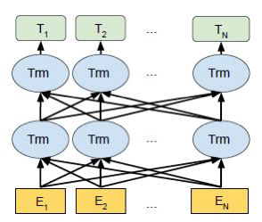
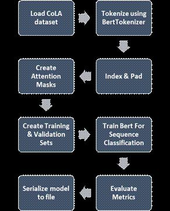
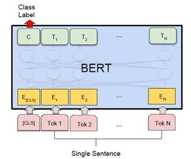

# Techshilla

This is the offical submission for the techshilla's problem statement by Ravindra Bhawan's team. 

## Models used

For the problem statement a number of models had to be used and were fine tuned accordingly to fit our need. These can be divided into 4 sections. These include 

1) [Question generation.](#question-generation)
2) [Speech to text convertor.](#speech-to-text-generation)
3) [Grammer error detection and correction.](#grammatical-error-detection)
4) [Feedback.](#feedback)

These models were fit into a certain pipeline to be used effectively. A detailed section for each of these could be found below.

# Question Generation

For generating the question we used Flan-Alpaca-Large / Llama 2 which are open source models but for them to be used we had to fine tune them. This was done by using a custom dataset which was made for scratch. The dataset contained the type of question to be generated and then the question to be generated

The fine tuning was a major huddle as using a untrained model would result in the question being used to not have a depth to them. 

The link for the custom dataset is [here](https://docs.google.com/spreadsheets/d/1K8H9LTCcvwUZwM5rkI62FLiknmnl_as5Kw0jyJdGBBI/edit?usp=sharinghttps://docs.google.com/spreadsheets/d/1K8H9LTCcvwUZwM5rkI62FLiknmnl_as5Kw0jyJdGBBI/edit?usp=sharing)

# Speech to Text Generation

This was one of the biggest task that had to be handled. The model not only had to convert speech to text but it also had to be efficient enough for it to not cause a bottle neck. Thus we decided to use OpenAI's whisper model. With this model we were able to convert speech to text.

When answering an interview question, one major factor to be considered was that whether or not the speaker was speaking at an optimatl pace. Usually the optimal pace depends on the type of question asked and the person speaking but, generally it should lie between 120 to 150 beats per minute. [Librosa](https://github.com/librosa/librosa) was used to find the Beats per minute/ Tempo and the user was accordingly given a review.

# Grammatical error detection 

Grammar Error Detection Model 

PromOne of the main roadblocks in teaching computers to understand language (Natural Language Processing) is the lack of training data. This field covers many specific tasks, and most datasets for these tasks are quite small, containing only thousands or a few hundred thousand examples labelled by humans.

To tackle this data shortage, researchers have come up with ways to train general-purpose language models using massive amounts of unlabeled text readily available online (this is called pre-training). These pre-trained models can then be further customized (fine-tuned) for specific NLP tasks like answering questions or understanding emotions (sentiment analysis). This approach leads to significantly better results compared to training from scratch on small datasets.

In February 2018, Google introduced a new and open-source technique for NLP pre-training called BERT.
 
We have used the pre-trained BERT for our GED (Grammar Error Detection Model) and fine-tuned it for our specific to our task.

BERT bidirection structure

 

There are two steps in BERT framework: pre-training and fine-tuning. During pre-training, the model is trained on unlabeled data over different pre-training tasks. For finetuning, the BERT model is first initialized with the pre-trained parameters, and all the parameters are fine-tuned using labeled data from the downstream tasks.

 

• We use the bert-base-uncased as the pre trained model. It consists of 12-layer, 768-hidden, 12-heads, 110M parameters and is trained on lower-cased English text.
• For fine-tuning we have used CoLA dataset for single sentence classification.
• SMOTE algorithm has been used to tackle the problem of data imbalance as the CoLa dataset is highly dataset with around 2 times correct labels than the incorrect ones.
• BertForSequenceClassification is a BERT model transformer with a sequence classification/regression head on top (a linear layer on top of the pooled output).
• We trained the network for 4 epochs, and on Google Colab with a Tesla K80 GPU, it takes about 25 minutes. After training we get a training loss of 0.04 and a validation accuracy of 0.83487.
• BERTAdam is used as an optimizer with learning rate 2*10-5
• Using the out of domain validation dataset from CoLA dataset to calculate the f1-score, we achieve a value of 0.856.
• Now, the built model is tested on the customized Responses Dataset and it gives the f1-score of 0.80 on it.
    

 

Grammar Error Correction Model

A seq2seq model basically consists of an encoder-decoder architecture. Seq2seq models have been proven to be effective in many NLP tasks, such as machine translation, text summarization, dialogue systems , and so on. To correct the potential errors, GEC systems have to understand the meaning of the sentences. 

 The encoder is a stack of 6 identical layers with two sub-layers, which are a multi-head self-attention layer and a position- wise fully connected feed-forward network. The decoder is also a stack of 6 identical layers. However, in the middle of each layer there is a third sub-layer which performs multi- head attention over the output of the encoder stack. The number of heads for Transformer self-attention is set to 8. The size of hidden Transformer feed-forward is 2,048. Both the dimension of word vectors on the source side and the tar- get side are 512. The parameters of our model are initialized with Xavier’s method. We apply dropout operations on the encoders and decoders, with a probability of 0.1. Our model adopts the Adam optimizer with an initial learning rate of 2, and a beta value of (0.9, 0.998).

Human and machine generated text often suffer from grammatical and/or typographical errors. It can be spelling, punctuation, grammatical or word choice errors. Gramformer is a library that exposes 3 seperate interfaces to a family of algorithms to detect, highlight and correct grammar errors. To make sure the corrections and highlights recommended are of high quality, it comes with a quality estimator. We have used Gramformer in our Grammar Correction Model and used the Seq2Seq model along with it to correct the sentences. Finally, we have used BLEU score as the evaluation metrics and calculated it for the customized responses dataset of ours. 
Along with the feature of grammar correction, we have implemented the get highlight function which will  highlight the portion where grammatical errors are present.

 • Tokenize the sentences using Spacy open-source library
 • Check for spelling errors 
 • For all preposition, determiners & helper verbs, create a set of probable sentences
 • Create a set of sentences with each word “masked”, deleted or an additional determiner, preposition   or helper verb added 
 • Used Seq2Seq Language Model to determine possible suggestions for masks 

                     
# Feedback

Feedback is given using accuracy score and was done using the following code 

      model = SentenceTransformer('sentence-transformers/all-MiniLM-L6-v2')

        #Compute embedding for both lists
        embedding_1= model.encode(Sentense1, convert_to_tensor=True)
        embedding_2 = model.encode(Sentense2, convert_to_tensor=True)

        similar=util.pytorch_cos_sim(embedding_1, embedding_2)

Belu score was also used to evaluate the model.